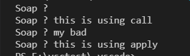

# THA to apply (call,bind,apply) functions, use some random eventListener and make a booking component

## 1. Call, Apply, Bind

## 2. Random Event Listener

Can you find it in index.html or booking component (hint: try a legendary cheat code) :)

## 3. Book Event

